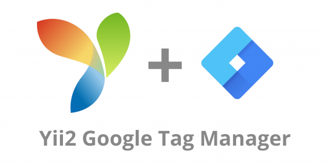

[](https://sonarcloud.io/dashboard?id=tomlutzenberger_yii2-googletagmanager)


Yii2 GoogleTagManager
=====================
Yii2 Widget for Google Tag Manager

Installation
------------

The preferred way to install this extension is through [composer](http://getcomposer.org/download/).

Either run

```
php composer.phar require --prefer-dist tomlutzenberger/yii2-googletagmanager "*"
```

or add

```
"tomlutzenberger/yii2-googletagmanager": "*"
```

to the required section of your `composer.json` file.


Usage
-----

Once the extension is installed, simply use it in your code by:

```php
<?= \TomLutzenberger\GoogleTagManager\GoogleTagManager::widget() ?>
```

You can either add the ID of your container to the `params.php`

```php
<?php
      
return [
    // ...
    'gtmId' => YII_ENV_PROD ? 'GTM-ASDF123' : '',
];
```

or pass it
directly to the widget: 

```php
<?= \TomLutzenberger\GoogleTagManager\GoogleTagManager::widget([
    'gtmId' => 'GTM-ASDF123'
]) ?>
```

License
-----
This package is published under the MIT License and can be used for any 
commercial and personal projects.
